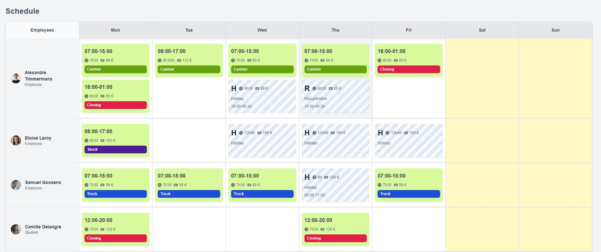

# Task Planner 🗓️


Welcome to **Task Planner**, your go-to app for managing tasks efficiently and effectively. Built with **Next.js**, **Tailwind CSS**, and **TypeScript**, Task Planner offers a modern and responsive interface for all your scheduling needs.

---

## Live version 🌍
👉 https://gm-task-planner.netlify.app/

## Getting Started 🚀

Follow these steps to get your Task Planner up and running:

## Step 1: Clone the Repository

First, clone the repository to your local machine:

```bash
git clone https://github.com/your-username/task-planner.git
cd task-planner
```

## Step 2: Install

Install the necessary dependencies using your preferred package manager:

```bash
npm install
# or
yarn install
```

## Step 3: Run the Development Server

Start the development server to see the Task Planner in action:

```bash
npm run dev
# or
yarn dev
```
Open http://localhost:3000 in your browser to see the app. The page will auto-update as you edit the code.

## Features ✨

Drag-and-Drop Interface: Easily move tasks around the schedule.
Customizable Tasks: Create, edit, and delete tasks with various attributes.
Responsive Design: Optimized for both desktop and mobile devices.
Persistent Storage: Tasks are saved locally to your browser.

## Technologies Used 🛠️

Next.js: A React framework for building server-side rendered and statically generated applications.
Tailwind CSS: A utility-first CSS framework for rapid UI development.
TypeScript: A statically typed superset of JavaScript for catching errors early and improving code quality.
  
## Project Structure 📂

```bash
.
├── public
│   └── assets          # Static assets like images
├── src
│   ├── app
│   │   ├── components  # Reusable UI components
│   │   ├── data        # Mock data for testing
│   │   └── types       # TypeScript types
│   ├── pages           # Next.js pages
│   └── styles          # Global styles and Tailwind CSS configuration
├── package.json        # Project metadata and scripts
└── README.md           # Project documentation
```

## Contributing 🤝
We welcome contributions! If you'd like to contribute to Task Planner, please fork the repository and create a pull request. Here are a few ways you can help:

## Fixing bugs 🐛
Adding new features 🚀
Improving documentation 📚

## Learn More 📘
To learn more about the technologies used in this project, check out the following resources:

- **Next.js Documentation** - Learn about Next.js features and API.
- **Tailwind CSS Documentation** - Explore Tailwind CSS utilities and configuration.
- **TypeScript Documentation** - Master TypeScript for improved code quality.


